<p align="center"></p>

# MealTime
MealTime is a MultiModule meal planning app built with Jetpack Compose. It helps you create custom meal plans, add your own recipes, and search online recipes.

Currently available on the Play Store

<a href='https://play.google.com/store/apps/details?id=com.kanyideveloper.mealtime'></a>

## Contributing Bug reports
We use GitHub for bug tracking. Please search the existing issues for your bug and create a new one if the issue is not yet tracked!

https://github.com/JoelKanyi/MealTime/issues


## Modules
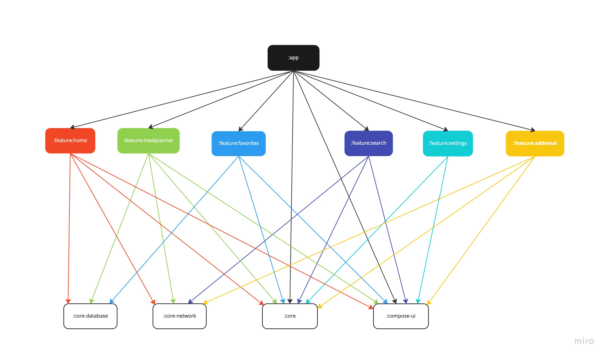

## Demo

### My Meals
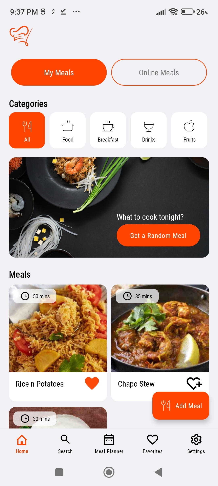 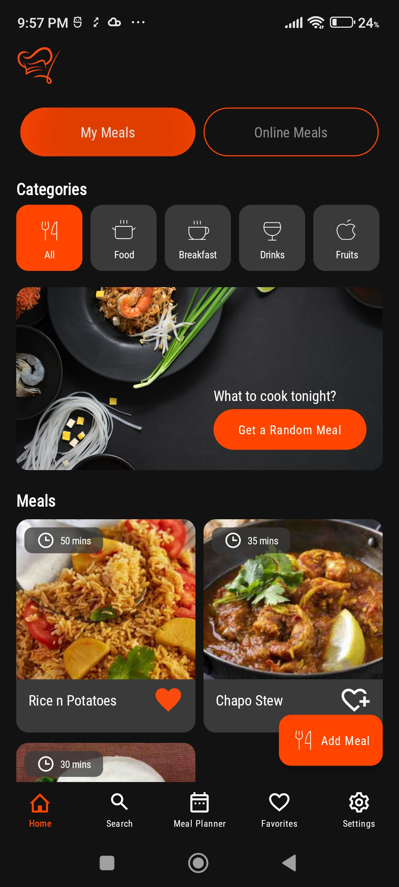

### Online Meals
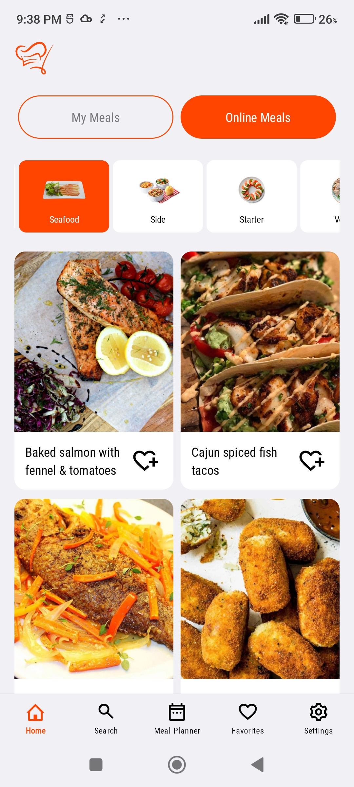 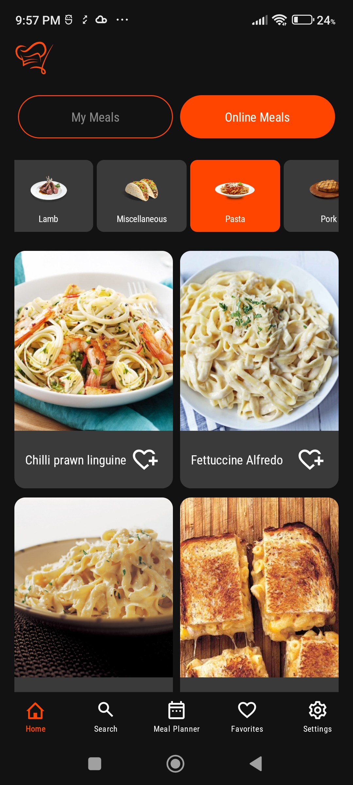

### Meal Details


### Meal Planner
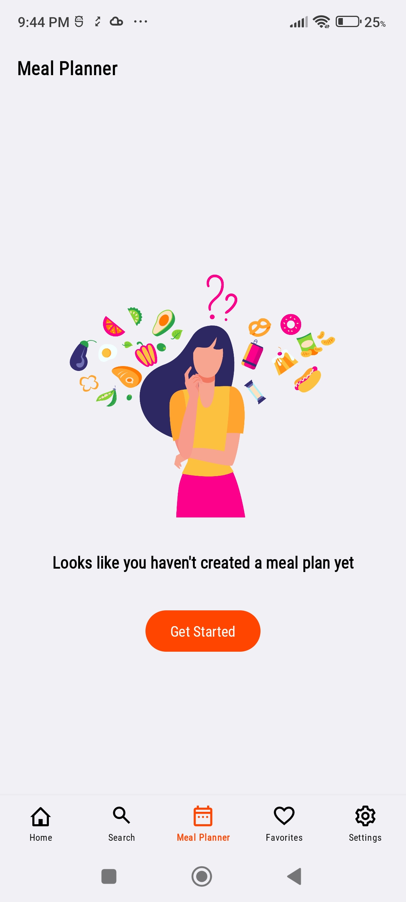 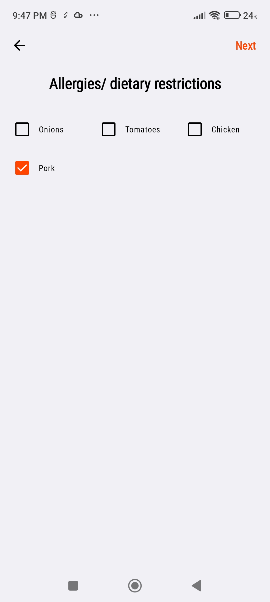

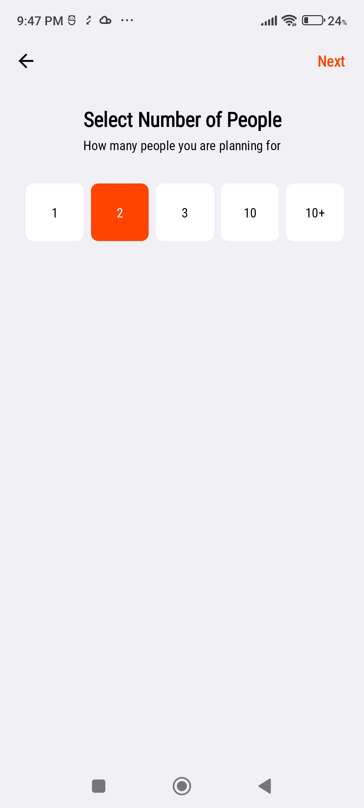 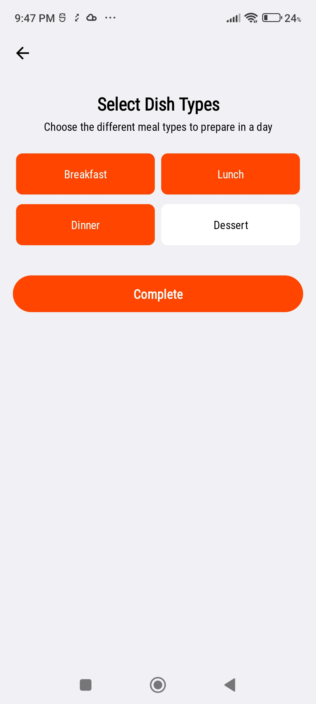

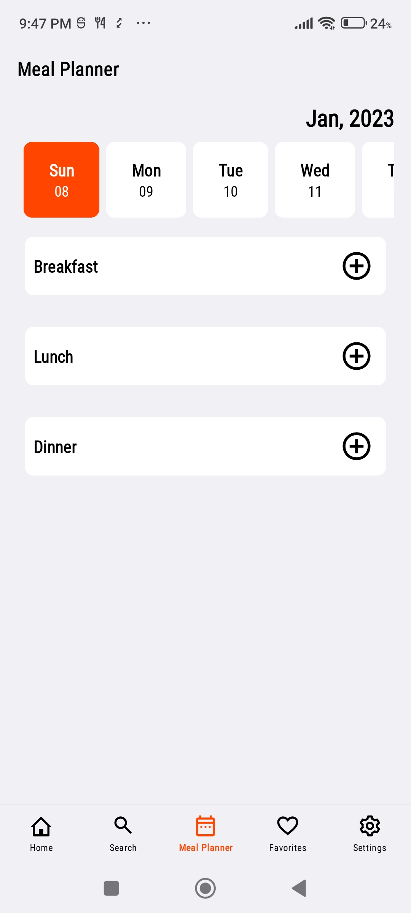 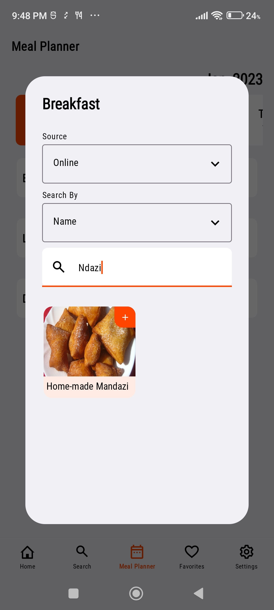 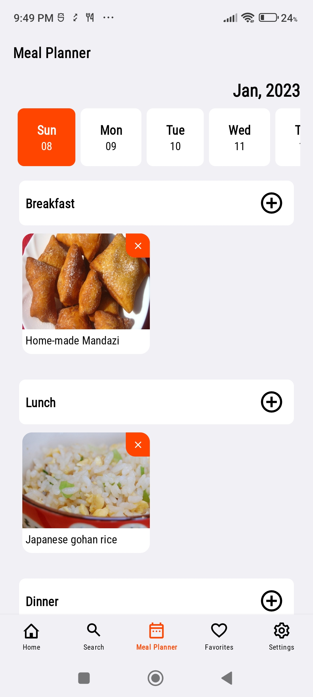

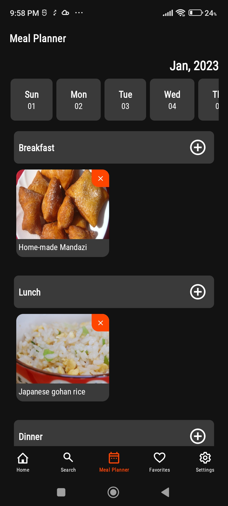

### Search
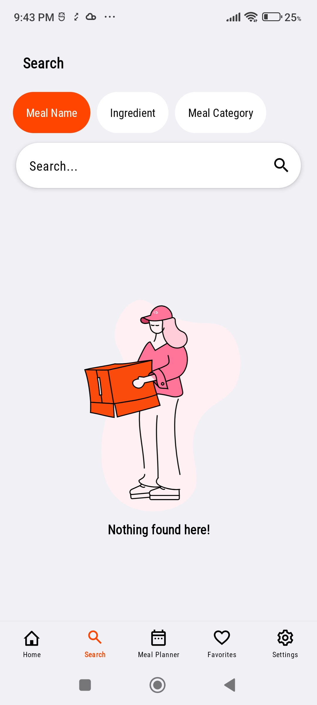 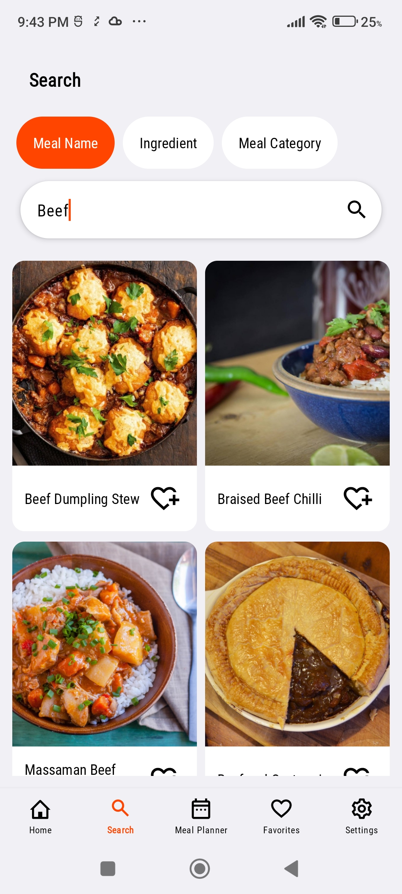

### Favorites
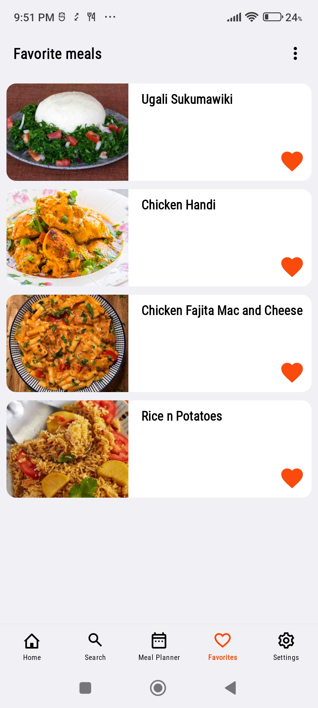 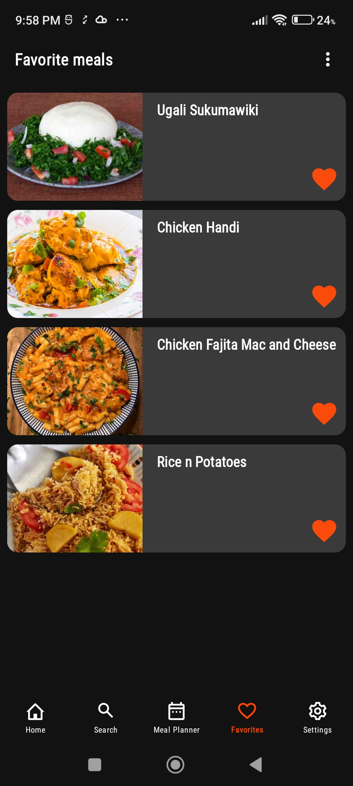

### Settings
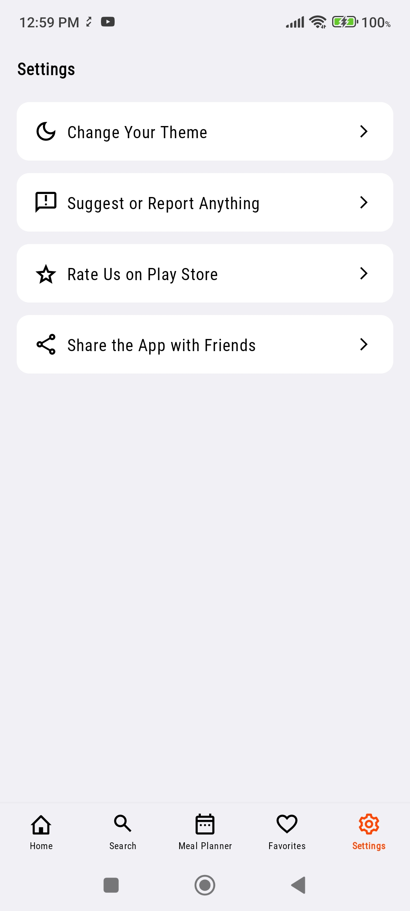 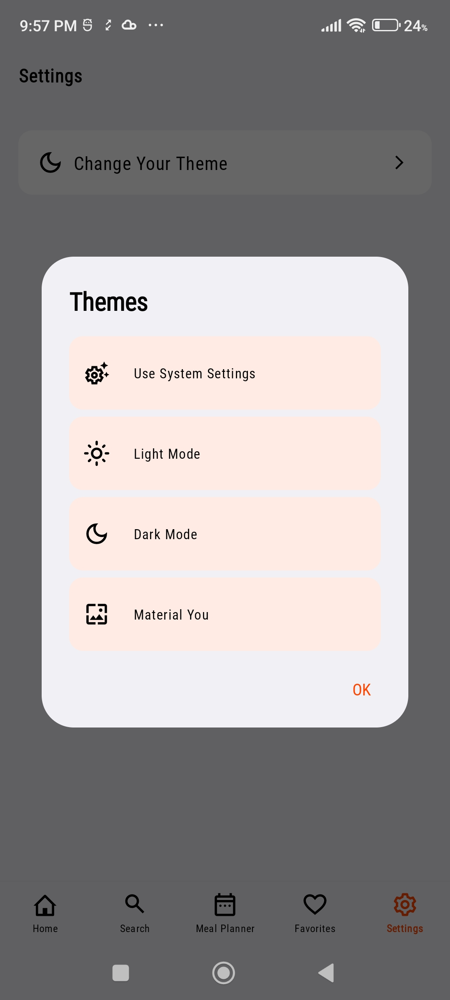

## Tech Stack.
- [Kotlin](https://developer.android.com/kotlin) - Kotlin is a programming language that can run on JVM. Google has announced Kotlin as one of its officially supported programming languages in Android Studio; and the Android community is migrating at a pace from Java to Kotlin.
- Jetpack components:
  - [Jetpack Compose](https://developer.android.com/jetpack/compose) - Jetpack Compose is Android’s modern toolkit for building native UI. It simplifies and accelerates UI development on Android. Quickly bring your app to life with less code, powerful tools, and intuitive Kotlin APIs.
  - [Android KTX](https://developer.android.com/kotlin/ktx.html) - Android KTX is a set of Kotlin extensions that are included with Android Jetpack and other Android libraries. KTX extensions provide concise, idiomatic Kotlin to Jetpack, Android platform, and other APIs.
  - [AndroidX](https://developer.android.com/jetpack/androidx) - Major improvement to the original Android [Support Library](https://developer.android.com/topic/libraries/support-library/index), which is no longer maintained.
  - [Lifecycle](https://developer.android.com/topic/libraries/architecture/lifecycle) - Lifecycle-aware components perform actions in response to a change in the lifecycle status of another component, such as activities and fragments. These components help you produce better-organized, and often lighter-weight code, that is easier to maintain.
  - [ViewModel](https://developer.android.com/topic/libraries/architecture/viewmodel) -The ViewModel class is designed to store and manage UI-related data in a lifecycle conscious way.
  - [LiveData](https://developer.android.com/topic/libraries/architecture/livedata) - LiveData is an observable data holder class. Unlike a regular observable, LiveData is lifecycle-aware, meaning it respects the lifecycle of other app components, such as activities, fragments, or services. This awareness ensures LiveData only updates app component observers that are in an active lifecycle state.
  - [Paging 3 library](https://developer.android.com/topic/libraries/architecture/paging/v3-overview) - The Paging library helps you load and display pages of data from a larger dataset from local storage or over network. This approach allows your app to use both network bandwidth and system resources more efficiently.
  - [Room database](https://developer.android.com/training/data-storage/room) - The Room persistence library provides an abstraction layer over SQLite to allow fluent database access while harnessing the full power of SQLite.
  - [Preferences DataStore](https://developer.android.com/topic/libraries/architecture/datastore) - Jetpack DataStore is a data storage solution that allows you to store key-value pairs or typed objects with protocol buffers. DataStore uses Kotlin coroutines and Flow to store data asynchronously, consistently, and transactional.

- [Kotlin Coroutines](https://developer.android.com/kotlin/coroutines) - A concurrency design pattern that you can use on Android to simplify code that executes asynchronously.
- [Retrofit](https://square.github.io/retrofit) -  Retrofit is a REST client for Java/ Kotlin and Android by Square inc under Apache 2.0 license. Its a simple network library that is used for network transactions. By using this library we can seamlessly capture JSON response from web service/web API.
- [GSON](https://github.com/square/gson) - JSON Parser,used to parse requests on the data layer for Entities and understands Kotlin non-nullable and default parameters.
- [Kotlin Flow](https://developer.android.com/kotlin/flow) - In coroutines, a flow is a type that can emit multiple values sequentially, as opposed to suspend functions that return only a single value.
- [Dagger Hilt](https://developer.android.com/training/dependency-injection/hilt-android) - A dependency injection library for Android that reduces the boilerplate of doing manual dependency injection in your project.
- [Ramcosta Navigation Library](https://composedestinations.rafaelcosta.xyz/) - A KSP library that processes annotations and generates code that uses Official Jetpack Compose Navigation under the hood. It hides the complex, non-type-safe and boilerplate code you would have to write otherwise.
- [Logging Interceptor](https://github.com/square/okhttp/blob/master/okhttp-logging-interceptor/README.md) -  logs HTTP request and response data.
- [Coil](https://coil-kt.github.io/coil/compose/)- An image loading library for Android backed by Kotlin Coroutines.
- [Timber](https://github.com/JakeWharton/timber)- A logger with a small, extensible API which provides utility on top of Android's normal Log class.
- CI/CD:
  - [GitHub Actions](https://github.com/features/actions) - GitHub Actions makes it easy to automate all your software workflows, now with world-class CI/CD. Build, test, and deploy your code right from GitHub. Make code reviews, branch management, and issue triaging work the way you want.
  

# License
```xml
Copyright 2023 JoelKanyi

    Licensed under the Apache License, Version 2.0 (the "License");
    you may not use this file except in compliance with the License.
    You may obtain a copy of the License at

    http://www.apache.org/licenses/LICENSE-2.0

    Unless required by applicable law or agreed to in writing, software
    distributed under the License is distributed on an "AS IS" BASIS,
    WITHOUT WARRANTIES OR CONDITIONS OF ANY KIND, either express or implied.
    See the License for the specific language governing permissions and
    limitations under the License.
```  
  
